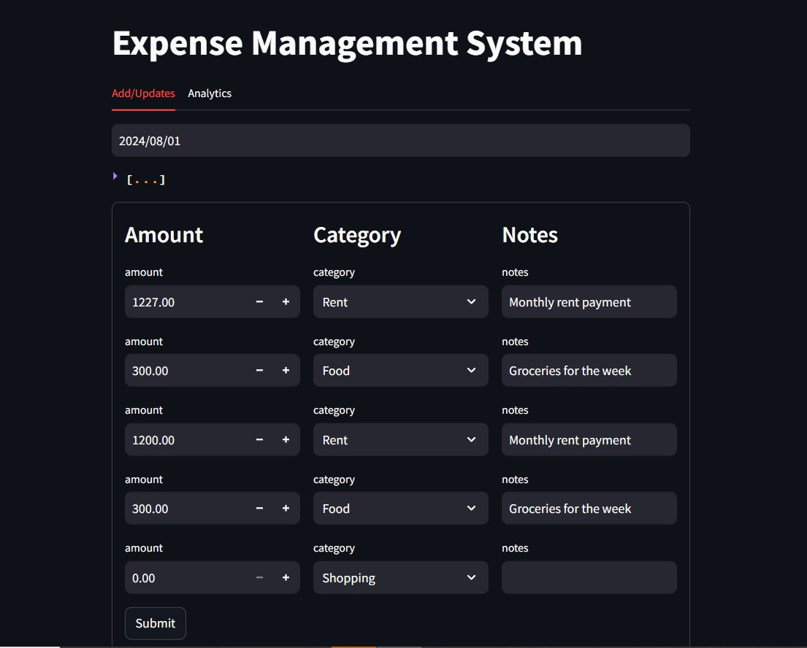

# 🧾 Expense Management System  

An interactive **Expense Management System** built using **Streamlit** and **FastAPI**. This app helps users track their expenses, categorize them, and analyze spending patterns.  

## 📌 Features  
✅ Add & Update Expenses  
✅ View and Analyze Expenses  
✅ Categorization of Expenses  
✅ Data Visualization with Charts  

## 🛠️ Technologies Used  
- **Frontend:** Streamlit  
- **Backend:** FastAPI  
- **Database:** (Specify your database here, e.g., PostgreSQL, MongoDB)  
- **Libraries:** Pandas, Requests  

## 📊 Usage Guide

- **Adding Expenses:** Navigate to the "Add/Updates" tab, enter details, and submit.
- **Viewing Expenses:** The entered expenses will be displayed from the API response.
- **Analyzing Expenses :** Switch to the "Analytics" tab, select a date range, and get insights.
- **Charts & Graphs:** The app displays sorted expense percentages using bar charts.

## 🚀 Installation & Setup

1️⃣ **Clone the Repository:**
    ```bash
    git clone https://github.com/your-username/expense-management-system.git  
    cd expense-management-system
    ```

2️⃣ **Install Dependencies:**
    ```commandline
    pip install -r requirements.txt  
    ```

3️⃣ **Run the Backend:**
    ```commandline
    uvicorn server:app --reload  
    ```

4️⃣ **Run the Frontend:**
    ```commandline
    streamlit run .\app.py
    ```

## Screenshots

### Home Page


### Expense Analytics

